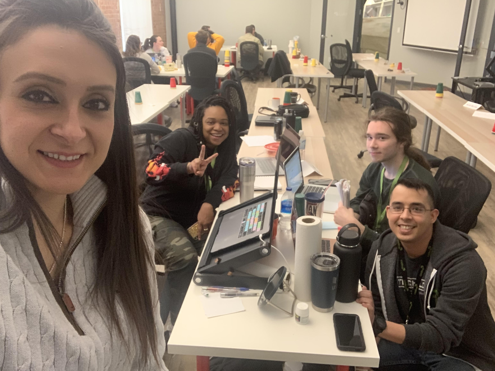

# bcrw.host
## Bexar County Road Watch
### A Codeup and CivTech production

### Developers ( Deimos Cohort ):
* Amber Jones, In/amberlovescats14, GitHub: /amberlovescats14
* Christopher Aguirre, In/christopher-aguirre210, GitHub: /christopheraguirre210 
* Melinda Greene, In/melindagreene, GitHub: /MelindaGreene
* River Robins, In/riverrobins, GitHub: /RiverRobins

Built in Java on the Spring framework, this application utilizes the MVC design pattern and is a collaborative
effort. We integrated official high water crossing data from the Data.SanAntonio.org's
GeoJson file and displayed them on MapBox according to the level of severity for the rainfall. Unifying MySQL
with Hybernate, we enable a database with a OneToOne, OneToMany, and ManyToMany relationship. Hashed
passwords are enforced using Spring Security and Geocoding is dispatched with a Java api service.

### Cloning this project:
* Go to https://github.com/RoadWatch/RoadWatch
* Press the green button to clone the project and copy the url
* Navigate to the folder in your terminal that you want the project to live in
* type in: git clone <theURLyouCopied>
* The project will now be in your folder finder, open the project in your favorite editor
* Right click the file in the root of the project called pom.xml and click "add as a maven project" or "add maven" 
* Insert this line in your git ignore: application.properties
* Then go to src => main => java => resources and you should see an example.properties file, select all and copy to
 your clipboard
* create a applications.properties file in the same directory as example.properties and and paste all the information
* insert your own user and password for MySQL and your own mapbox token
* start the application
* It is important to note that if you did not fork this repo, you will not be able to push to the project structure

### Forking this project:
* Go to https://github.com/RoadWatch/RoadWatch
* Press the fork button in the top right of the page, the project is now yours and you can build from there
* Press the green button to clone the project and copy the url
* Navigate to the folder in your terminal that you want the project to live in
* type in: git clone <theURLyouCopied>
* The project will now be in your folder finder, open the project in your favorite editor
* Right click the file in the root of the project called pom.xml and click "add as a maven project" or "add maven" 
* Insert this line in your git ignore: application.properties
* Then go to src => main => java => resources and you should see an example.properties file, select all and copy to
 your clipboard
* create a applications.properties file in the same directory as example.properties and and paste all the information
* insert your own user and password for MySQL and your own mapbox token
* start the application

